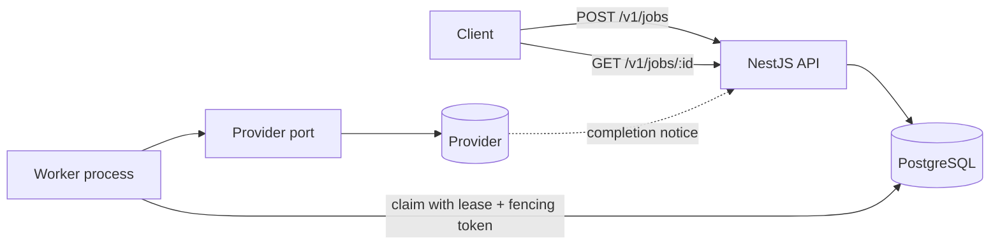

# AFDS Generation Platform

[](https://github.com/hyojii00/afds-generation-platform/actions/workflows/verify.yml)

A portfolio-safe reference implementation for building an asynchronous media-generation platform through small, evidence-driven pull requests.

The repository demonstrates two things together:

- **A backend** that evolves from job acceptance toward reliable asynchronous execution: NestJS on Fastify, PostgreSQL through Drizzle, SWC for production output, and TypeScript as a separate type-safety gate.
- **An Agent-First Development System (AFDS)** where repository-owned plans, decision gates, tests, and evidence — not chat history — decide whether a change is acceptable.

Every capability below arrived through one bounded loop with its own plan, acceptance criteria, and evidence ledger in `docs/plans`.

## How a job runs



```http
POST /v1/jobs
Content-Type: application/json

{
  "prompt": "A cinematic sunrise over Seoul",
  "provider": "mock"
}
```

The API accepts the job and stores it as the durable work item — no broker, no outbox. A worker claims one row with `FOR UPDATE SKIP LOCKED`, holds it under a 30-second lease and a UUID fencing token, and calls the provider through a port that knows nothing about HTTP. A provider that answers immediately settles the job; one that answers `202` parks it, releases the lease, and reports the outcome later through a callback authenticated by a per-attempt token. Three attempts, 1-second and 2-second backoffs, and every deadline measured by PostgreSQL's own clock rather than a worker's.

`GET /v1/jobs/:id` reports `queued`, `processing`, `succeeded`, or `failed` — the same four values and the same response fields since the first loop.

## What is worth reading

| Question | Where it is answered |
| --- | --- |
| Why PostgreSQL leasing instead of a broker or an outbox | [Loop 003 plan](docs/plans/completed/003-execute-jobs-reliably.md) |
| How duplicate provider work is prevented | [Loop 004 plan](docs/plans/completed/004-isolate-provider-integrations.md) |
| Why callbacks use a per-attempt token, not a shared secret | [ADR 0003](docs/architecture/decisions/0003-authenticate-provider-callbacks.md) |
| What the system may not do yet, and what unlocks it | [Architecture evolution gates](docs/architecture/system.md) |
| How a change becomes acceptable here | [`.afds/constitution.md`](.afds/constitution.md), [`WORKFLOW.md`](WORKFLOW.md) |

Loop 006 is the active plan in `docs/plans/active-loop.md`; the roadmap and its non-active candidates live in `docs/plans/candidates/README.md`.

## Repository shape

| Path | Responsibility |
| --- | --- |
| `.afds` | Stable AI-first development principles and loop protocol |
| `docs/product` | Product purpose, scope, and non-goals |
| `docs/architecture` | Current boundaries and explicit evolution gates |
| `docs/plans` | The single active loop and its evidence ledger |
| `packages/generation` | Framework-independent generation behavior |
| `apps/api` | NestJS HTTP delivery, the worker entrypoint, and PostgreSQL and provider adapters |
| `drizzle` | Versioned PostgreSQL migrations |

## Development

```bash
corepack enable
pnpm install --frozen-lockfile
cp .env.example .env
docker compose up -d --wait postgres
pnpm db:migrate
pnpm verify
pnpm dev:api
```

The API listens on `http://localhost:3000` by default; set `PORT` to override it, and `GET /health` reports whether it can serve requests. Use `pnpm build && pnpm start:api` to run the SWC-compiled output, and `pnpm start:worker` to run the worker process beside it. The API requires `DATABASE_URL` and an applied migration and fails startup instead of falling back to memory. `pnpm verify` uses isolated PostgreSQL containers, so Docker must be available. See `docs/runbooks/local-development.md` for operations and cleanup.

## Portfolio safety

This repository uses a synthetic domain and local mock provider. It contains no employer source code, data model, prompts, customer data, credentials, or internal identifiers.

## License

MIT. See `LICENSE`.
