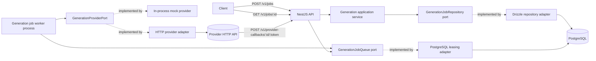

# System Architecture

## Current boundary

The generation package owns job state, lifecycle transitions, execution policy, the repository port, and the queue port without importing NestJS, database, or worker entrypoint code. The API owns HTTP validation, status mapping, the PostgreSQL adapters, and database lifecycle. The worker is a separate process built from the same package and shares only PostgreSQL with the API.

## Execution boundary

`generation_jobs` is the durable work item. A worker claims one row with `FOR UPDATE SKIP LOCKED`, increments its attempt, and holds it under a UUID fencing token and a 30-second lease. A result applies only while the row is `processing`, carries that token, and holds an unexpired lease, so a worker that lost its lease cannot overwrite the outcome. Availability, expiry, and fencing all compare against `now()`, the PostgreSQL transaction timestamp, so worker clock skew cannot change ownership.

Three attempts are allowed. A retryable failure returns the job to `queued` behind a 1-second and then a 2-second backoff; the third retryable failure and every permanent failure are terminal. Expired leases below the attempt limit return to `queued`, and an expired final attempt becomes `failed`.

The API uses Fastify rather than Express. TypeScript performs static verification, and SWC produces the runnable JavaScript artifacts as recorded in [ADR 0001](decisions/0001-use-fastify-and-swc.md).

## Intentional limitation

Accepted jobs survive API and worker restarts against the same migrated database. Neither process runs migrations automatically, and both fail startup when configuration, connectivity, or schema state is unusable. Leasing fences persisted state application; the idempotency key is what keeps a repeated provider call from duplicating accepted work. A provider that answers later must call the completion route inside the wait deadline; nothing polls it. Retry backoffs are fixed, without jitter or global rate limiting.

## Provider boundary

The worker depends on `GenerationProviderPort`, never on a transport. The port takes a job identifier, a prompt, and a provider name and returns one normalized reference; provider payloads, headers, and credentials stop at the adapter.

Configuration chooses the implementation: the in-process mock provider by default, the HTTP adapter when `PROVIDER_BASE_URL` is set. The adapter sends the job identifier as an idempotency key, so an attempt repeated after a timeout cannot duplicate accepted work, and bounds every call with `PROVIDER_TIMEOUT_MS` (5 seconds by default), which must stay under the 30-second lease.

Failures are normalized into two kinds. `429`, `5xx`, connection failure, and timeout are transient and enter the Loop 003 retry path; every other `4xx` and any success body without a usable identifier are permanent and end the job on its first attempt. Normalized failures carry the provider status and a fixed reason, never a response body or a credential.

## Completion boundary

A provider may answer `completed` or `accepted`. Accepted work moves to `awaiting_provider`: the worker persists the reference, releases its lease and fencing token, records a deadline, and claims something else. Clients keep the four statuses Loop 003 defined, so an awaiting job reports as `processing`.

Every claim issues one callback token and stores only its SHA-256 hash. The adapter composes the callback URL from `PUBLIC_CALLBACK_BASE_URL`, the job identifier, and that token. A notice applies while the row still belongs to the attempt that issued the token — `processing` or `awaiting_provider`, with an unexpired deadline once one exists — so a provider that calls back before the worker finishes parking the job is not lost; the same statement clears the hash, so a second delivery, a stale attempt's token, or an unknown job matches nothing. Every rejection answers `404`, so the route reveals nothing. [ADR 0003](decisions/0003-authenticate-provider-callbacks.md) records why the token is per attempt rather than a shared secret or a signature.

A wait whose deadline passes is recovered by the worker's recovery pass as a retryable failure: it returns to `queued` behind the Loop 003 backoff while attempts remain, and becomes `failed` on the last one. Loop 004's idempotency key keeps the resubmitted attempt from duplicating accepted work.

## Runtime visibility

`GET /health` runs the query startup uses, so `200 {"status":"ok"}` means this process can serve `GET /v1/jobs/:id`, not merely that it is running. An unusable database answers `503 {"status":"unavailable"}` with nothing else; the driver's message goes to the log. The route sits outside `/v1` because it reports on the runtime rather than on the product API, and it carries no authentication.

The API logs one structured line per request through the Fastify runtime, recording the method and a path whose callback token is redacted — that token is the callback route's only authentication, so it never reaches a log. The worker owns what happened to a job and reports it through an observer port; the JSON adapter outside the generation package writes one `generation_job.settled` line per job with its identifier, attempt, and outcome. Only named fields are logged, so prompts, callback tokens, credentials, and provider payloads cannot reach a log line through it. `LOG_LEVEL` sets the level for both processes and silences them; an empty or unknown value falls back to `info` rather than failing startup. `GET /health` bounds its own check, so an exhausted pool answers `503` instead of hanging.

## Evolution gates

- Persistent schema changes require a versioned forward migration and adapter evidence.
- A second inbound route or another notice sender requires its own authentication decision.
- Metrics, tracing, or log shipping requires a decision about what the platform exports and to whom.
- A second provider adapter requires the contract suite to run against it unchanged.
- External providers require mock-first contract tests and credential isolation.
- Authentication requires a threat model and key-rotation decision.
