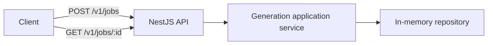

# System Architecture

## Current boundary

The generation package owns job state and application behavior without importing NestJS. The API is a delivery adapter and owns HTTP validation and status mapping.

The API uses Fastify rather than Express. TypeScript performs static verification, and SWC produces the runnable JavaScript artifacts as recorded in [ADR 0001](decisions/0001-use-fastify-and-swc.md).

## Intentional limitation

The repository is process-local in the first loop. Restarting the API loses jobs, multiple API replicas do not share state, and no asynchronous work starts. This is accepted only for proving the initial contract.

## Evolution gates

- Persistent state requires an explicit schema and migration decision.
- Asynchronous execution requires delivery semantics, idempotency, retry, and failure-state decisions.
- External providers require mock-first contract tests and credential isolation.
- Authentication requires a threat model and key-rotation decision.
