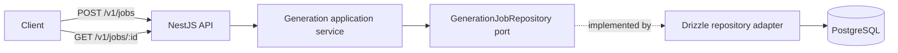

# System Architecture

## Current boundary

The generation package owns job state, application behavior, and the repository port without importing NestJS or database code. The API owns HTTP validation, status mapping, the PostgreSQL adapter, and database lifecycle.

The API uses Fastify rather than Express. TypeScript performs static verification, and SWC produces the runnable JavaScript artifacts as recorded in [ADR 0001](decisions/0001-use-fastify-and-swc.md).

## Intentional limitation

Accepted jobs survive API restarts against the same migrated database. The API does not run migrations automatically and fails startup when configuration, connectivity, or schema state is unusable. No asynchronous worker starts, so jobs remain `queued`.

## Evolution gates

- Persistent schema changes require a versioned forward migration and adapter evidence.
- Asynchronous execution requires delivery semantics, idempotency, retry, and failure-state decisions.
- External providers require mock-first contract tests and credential isolation.
- Authentication requires a threat model and key-rotation decision.
