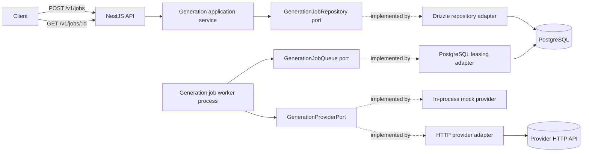

# System Architecture

## Current boundary

The generation package owns job state, lifecycle transitions, execution policy, the repository port, and the queue port without importing NestJS, database, or worker entrypoint code. The API owns HTTP validation, status mapping, the PostgreSQL adapters, and database lifecycle. The worker is a separate process built from the same package and shares only PostgreSQL with the API.

## Execution boundary

`generation_jobs` is the durable work item. A worker claims one row with `FOR UPDATE SKIP LOCKED`, increments its attempt, and holds it under a UUID fencing token and a 30-second lease. A result applies only while the row is `processing`, carries that token, and holds an unexpired lease, so a worker that lost its lease cannot overwrite the outcome. Availability, expiry, and fencing all compare against `now()`, the PostgreSQL transaction timestamp, so worker clock skew cannot change ownership.

Three attempts are allowed. A retryable failure returns the job to `queued` behind a 1-second and then a 2-second backoff; the third retryable failure and every permanent failure are terminal. Expired leases below the attempt limit return to `queued`, and an expired final attempt becomes `failed`.

The API uses Fastify rather than Express. TypeScript performs static verification, and SWC produces the runnable JavaScript artifacts as recorded in [ADR 0001](decisions/0001-use-fastify-and-swc.md).

## Intentional limitation

Accepted jobs survive API and worker restarts against the same migrated database. Neither process runs migrations automatically, and both fail startup when configuration, connectivity, or schema state is unusable. Leasing fences persisted state application; the idempotency key is what keeps a repeated provider call from duplicating accepted work. Providers must answer within the request timeout: asynchronous completion notices are not implemented. Retry backoffs are fixed, without jitter or global rate limiting.

## Provider boundary

The worker depends on `GenerationProviderPort`, never on a transport. The port takes a job identifier, a prompt, and a provider name and returns one normalized reference; provider payloads, headers, and credentials stop at the adapter.

Configuration chooses the implementation: the in-process mock provider by default, the HTTP adapter when `PROVIDER_BASE_URL` is set. The adapter sends the job identifier as an idempotency key, so an attempt repeated after a timeout cannot duplicate accepted work, and bounds every call with `PROVIDER_TIMEOUT_MS` (5 seconds by default), which must stay under the 30-second lease.

Failures are normalized into two kinds. `429`, `5xx`, connection failure, and timeout are transient and enter the Loop 003 retry path; every other `4xx` and any success body without a usable identifier are permanent and end the job on its first attempt. Normalized failures carry the provider status and a fixed reason, never a response body or a credential.

## Evolution gates

- Persistent schema changes require a versioned forward migration and adapter evidence.
- Asynchronous provider completion requires a waiting state, an authenticated inbound notice, and a deadline sweeper.
- A second provider adapter requires the contract suite to run against it unchanged.
- External providers require mock-first contract tests and credential isolation.
- Authentication requires a threat model and key-rotation decision.
